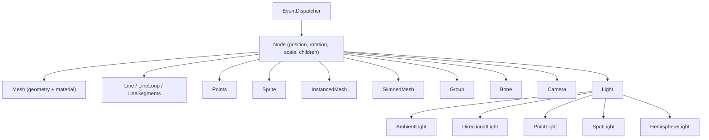

# Agents Guide - EASEL.js

For AI coding agents (Copilot Workspace, Cursor, Claude Code, etc.).

## Repository structure

| Directory        | Contents                                                                  |
| ---------------- | ------------------------------------------------------------------------- |
| `src/core/`      | EventDispatcher, Node, Scene, Clock, Raycaster, Constants                 |
| `src/cameras/`   | Camera (orthographic only)                                                |
| `src/math/`      | Vector2/3/4, Matrix3/4, Quaternion, Euler, Color, MathUtils               |
| `src/geometry/`  | Geometry, Attribute, primitives/ (Box, Sphere, Cylinder, etc.)            |
| `src/materials/` | Material base, BasicMaterial, LambertMaterial, ToonMaterial, LineMaterial |
| `src/textures/`  | Texture, CanvasTexture, DataTexture, FramebufferTexture                   |
| `src/objects/`   | Mesh, Group, Line, Points, Sprite, InstancedMesh, SkinnedMesh             |
| `src/lights/`    | AmbientLight, DirectionalLight, PointLight, SpotLight, HemisphereLight    |
| `src/animation/` | Animator, AnimationClip, Track, Binding, tracks/                          |
| `src/curves/`    | Curve, Path, Shape, curves/                                               |
| `src/loaders/`   | FileLoader, TextureLoader, ObjectLoader, etc.                             |
| `src/scenes/`    | Fog                                                                       |
| `src/helpers/`   | AxesHelper, BoxHelper, GridHelper, light helpers                          |
| `src/renderers/` | Renderer (Canvas2D software renderer)                                     |
| `src/pipeline/`  | Full rasterization pipeline (see below)                                   |
| `tests/`         | Mirrors src/ structure, *.test.js files                                   |
| `docs/`          | Design documentation                                                      |

## Pipeline architecture

The render pipeline is CPU-only, in this order:

1. **SceneTraversal** - walks scene graph, collects visible nodes
2. **PainterSort** - sorts draw list back-to-front (tile distance → layer → polygon centroid)
3. **Projection** - `WorldToView` → `ViewToScreen` (with `Math.trunc()` integer snap)
4. **Shading** - `LightBaker` applies lights, then `FlatShader` or `GouraudShader`
5. **Rasterizer** - `ScanlineFill` with `EdgeWalker`, `AffineUVSampler`, `GouraudInterpolator`
6. **Color** - `Hsl16` ↔ RGB via `ColorTable`, `TranslucencyTable` for opacity blending
7. **Framebuffer** - `PixelWriter` → `Framebuffer` → `FramebufferUpload` to canvas

## Class hierarchy

## Testing patterns

- Framework: Vitest
- Path alias: `@/` → `src/`
- Structure: `describe` / `it` blocks
- Location: `tests/` mirrors `src/` (e.g., `tests/math/Vector3.test.js`)
- Helpers: `tests/_helpers/` for shared test utilities

## What NOT to do

- **No GPU/WebGL concepts** - no shader programs, no WebGL state, no GPU buffers
- **No z-buffer** - depth is resolved by sort order, not per-pixel testing
- **No per-pixel lighting** - all lighting is baked per-vertex or per-face before rasterization
- **No perspective camera** - affine UV interpolation is only correct under orthographic projection
- **No continuous alpha** - opacity is an integer 0–8, not a float
- **No shadow maps** - no shadow system exists
- **No PBR materials** - no MeshStandardMaterial, no MeshPhongMaterial, no roughness/metalness
- **No environment maps** - no skybox, no reflections, the void is black

When adding features, ask: "Would this exist in a CPU scanline rasterizer with no z-buffer?" If no, it does not belong here.
