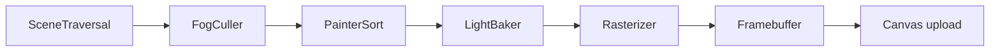

# EASEL.js

[](https://github.com/xsyetopz/easel.js/actions/workflows/ci.yml)
[](https://github.com/xsyetopz/easel.js/stargazers)
[](https://www.npmjs.com/package/@xsyetopz/easel)
[](https://jsr.io/@xsyetopz/easel)
[](LICENSE)

EASEL.js is a TypeScript Canvas2D software renderer for browser-side 3D scenes.
It gives you THREE-style scene objects, a CPU rasterization pipeline, and
deterministic canvas pixels without WebGL.

[Website](https://easeljs.org) · [Examples](https://easeljs.org/examples) ·
[API docs](https://easeljs.org/docs) ·
[npm](https://www.npmjs.com/package/@xsyetopz/easel) ·
[JSR](https://jsr.io/@xsyetopz/easel)

## Status

| Item         | Current value               |
| ------------ | --------------------------- |
| Package      | `@xsyetopz/easel`           |
| Revision     | `0.6.1`                     |
| Source       | TypeScript                  |
| Runtime deps | none                        |
| Output       | Canvas2D `ImageData` upload |
| License      | ISC                         |

## Usage

Use EASEL.js when:

- You want browser-side 3D drawn through Canvas2D instead of WebGL.
- You need CPU rasterization stages that stay inspectable in source and tests.
- You want familiar Scene, Mesh, Camera, Light, Material, Geometry, and math
  APIs.
- You accept old-engine limits: affine UVs, nearest-neighbor textures, discrete
  opacity, and no PBR.

## Install

```bash
npm install @xsyetopz/easel
yarn add @xsyetopz/easel
pnpm add @xsyetopz/easel
bun add @xsyetopz/easel
deno add npm:@xsyetopz/easel
```

JSR users can install with `deno add jsr:@xsyetopz/easel` or
`bunx jsr add @xsyetopz/easel`.

### Portable agent skills

The repository includes cross-tool `using-easeljs` and `threejs-to-easeljs`
Agent Skills under `.agents/skills/`. Install either with Vercel's skills CLI:

```bash
bunx skills add xsyetopz/easel.js --skill using-easeljs
bunx skills add xsyetopz/easel.js --skill threejs-to-easeljs
bunx skills add . --skill using-easeljs
bunx skills add . --skill threejs-to-easeljs
```

Both skills target the current 0.6.1 source/API revision; `using-easeljs`
includes reference recipes and starter templates, while `threejs-to-easeljs`
covers focused THREE.js translation.

## Quick start

Add a canvas:

```html
<canvas></canvas>
```

Render a lit cube:

```js
import * as EASEL from "@xsyetopz/easel";

const [WIDTH, HEIGHT] = [800, 600];
const canvas = document.querySelector("canvas");

if (!(canvas instanceof HTMLCanvasElement)) {
  throw new Error("Add a <canvas> element to the page.");
}

const renderer = new EASEL.Renderer({ canvas, width: WIDTH, height: HEIGHT });
const aspect = WIDTH / HEIGHT;

const scene = new EASEL.Scene();
scene.background = 0xf3f7fc;

const camera = new EASEL.OrthographicCamera({
  left: -2 * aspect,
  right: 2 * aspect,
  top: 2,
  bottom: -2,
  near: 0.1,
  far: 100,
});
camera.position.set(0, 0, 5);

scene.add(new EASEL.AmbientLight(0xffffff, 0.4));
const sun = new EASEL.DirectionalLight(0xffffff, 0.8);
sun.position.set(3, 5, 4);
scene.add(sun);

const box = new EASEL.Mesh(
  new EASEL.BoxGeometry(1, 1, 1),
  new EASEL.LambertMaterial({ color: 0xff4444 }),
);
scene.add(box);

function animate() {
  requestAnimationFrame(animate);
  box.rotation.y += 0.01;
  renderer.render(scene, camera);
}

animate();
```

## Scene graph

EASEL.js mirrors THREE.js names where that helps, while keeping rendering
CPU-only.

| Category      | Classes                                                                                                                                                                                |
| ------------- | -------------------------------------------------------------------------------------------------------------------------------------------------------------------------------------- |
| **Core**      | `Scene`, `Node`, `Group`, `Mesh`, `Raycaster`, `Clock`, `Layers`                                                                                                                       |
| **Cameras**   | `OrthographicCamera`, `PerspectiveCamera`                                                                                                                                              |
| **Lights**    | `AmbientLight`, `DirectionalLight`, `PointLight`, `SpotLight`, `HemisphereLight`                                                                                                       |
| **Materials** | `BasicMaterial`, `LambertMaterial`, `ToonMaterial`, `LineMaterial`, `DashedLineMaterial`, `PointsMaterial`                                                                             |
| **Geometry**  | `BoxGeometry`, `SphereGeometry`, `PlaneGeometry`, `CylinderGeometry`, `TorusGeometry`, `TorusKnotGeometry`, `CapsuleGeometry`, `ExtrudeGeometry`, `ShapeGeometry`, `WireframeGeometry` |
| **Textures**  | `Texture`, `CanvasTexture`, `DataTexture`, `FramebufferTexture`, `VideoTexture`                                                                                                        |
| **Objects**   | `Mesh`, `Group`, `Line`, `LineLoop`, `LineSegments`, `Points`, `Sprite`, `InstancedMesh`, `SkinnedMesh`, `Bone`, `Skeleton`                                                            |
| **Helpers**   | `AxesHelper`, `BoxHelper`, `GridHelper`, `DirectionalLightHelper`, `PointLightHelper`, `SpotLightHelper`                                                                               |
| **Controls**  | `OrbitControls`                                                                                                                                                                        |
| **Animation** | `Animator`, `AnimationAction`, `AnimationClip`, `Track`, `Binding`, `PropertyMixer`                                                                                                    |
| **Math**      | `Vector2`, `Vector3`, `Vector4`, `Matrix3`, `Matrix4`, `Quaternion`, `Euler`, `Color`, `Ray`, `Frustum`, `MathUtils`                                                                   |
| **Loaders**   | `FileLoader`, `ImageLoader`, `TextureLoader`, `ObjectLoader`, `MaterialLoader`, `GeometryLoader`, `AnimationLoader`, `DataTextureLoader`                                               |

### THREE.js name mapping

| THREE.js              | EASEL.js          | Reason                         |
| --------------------- | ----------------- | ------------------------------ |
| `Object3D`            | `Node`            | Scene graph node               |
| `BufferGeometry`      | `Geometry`        | No GPU buffers                 |
| `WebGLRenderer`       | `Renderer`        | Canvas2D software renderer     |
| `MeshBasicMaterial`   | `BasicMaterial`   | "Mesh" prefix redundant        |
| `MeshLambertMaterial` | `LambertMaterial` | Same lighting model name       |
| `MeshToonMaterial`    | `ToonMaterial`    | Same shading family            |
| `AnimationMixer`      | `Animator`        | Plays clips                    |
| `KeyframeTrack`       | `Track`           | All tracks are keyframe tracks |

## Rendering pipeline



- **Depth is CPU-owned** - opaque fragments use a CPU `DepthBuffer`; transparent
  materials still depend on sorted draw order.
- **Painter sorting still matters** - `renderer.sortObjects` groups opaque and
  transparent calls, then sorts where depth buffering cannot guarantee the
  result.
- **Flat and Gouraud shading** - lighting is baked per-face or per-vertex before
  rasterization.
- **Affine UV mapping** - no perspective-correct interpolation; perspective
  camera textures can warp by design.
- **Scene background** - `scene.background` accepts `Color`, hex number, or a
  screen-space `Texture`; fog color overrides it.
- **Texture limits** - source images clamp to 128×128 and sample
  nearest-neighbor; no mipmaps.
- **Discrete opacity** - opacity is stored in fixed steps; translucent materials
  should set `transparent: true`.
- **No GPU lifecycle** - no WebGL state, shader programs, GPU buffers, shadow
  maps, PBR, or environment maps.

## Development

```bash
bun install
bun run dev                 # generate docs, then run Astro dev server
bun run build               # package build
bun run www:build           # generate and build docs/examples site
bun run bench               # render benchmark suite
bun run test:run            # bun:test
bun run typecheck           # package TypeScript check
bun run typecheck:tests     # test TypeScript check
bun run typecheck:website   # website TypeScript check
bun run biome:check         # Biome lint + format
bun run release:check       # full release gate
```

## Troubleshooting

| Symptom                        | Check                                                                                                                               |
| ------------------------------ | ----------------------------------------------------------------------------------------------------------------------------------- |
| Nothing appears                | Confirm the canvas size, camera framing, lights/materials, and `renderer.render(scene, camera)` call.                               |
| Textures look pixelated        | This is expected: textures clamp to 128×128 and sample nearest-neighbor.                                                            |
| Perspective textures warp      | This is expected: UV interpolation is affine, not perspective-correct. Use `OrthographicCamera` when exact texture mapping matters. |
| Transparent objects sort oddly | Keep translucent materials on explicit layers and sort-friendly geometry; opacity is blended after opaque depth writes.             |
| Texture background not visible | Assign a ready `Texture` to `scene.background`; if `scene.fog` is set, fog color wins.                                              |
| Examples will not run          | Run `bun install`, then `bun run dev`.                                                                                              |

## Benchmarks

```bash
bun run bench -- --list
bun run bench -- --workload=mesh-grid-gouraud --warmup=20 --samples=20 --frames=3 --json=results.json
bun run dev
```

The CLI suite reports FPS, warmup-adjusted samples, p50/p95 frame timing,
pipeline stage timing, runtime metadata, and JSON output. The browser suite is
in the examples site under Performance → Render Benchmark Suite and exposes the
same methodology with copyable JSON results.

## Contributing

Contributions welcome. See [CONTRIBUTING.md](CONTRIBUTING.md) for workflow,
coding guidelines, and the PR checklist.

## AI / Coding agents

Start with [AGENTS.md](AGENTS.md). It names the repo layout, current commands,
docs sources, and renderer boundaries agents must preserve.

## Code of Conduct

All contributors are expected to follow the
[Code of Conduct](CODE_OF_CONDUCT.md).

## Star History

<a href="https://www.star-history.com/?repos=xsyetopz%2Feasel.js&type=date&logscale=&legend=top-left">
 <picture>
   <source media="(prefers-color-scheme: dark)" srcset="https://api.star-history.com/image?repos=xsyetopz/easel.js&type=date&theme=dark&logscale&legend=top-left" />
   <source media="(prefers-color-scheme: light)" srcset="https://api.star-history.com/image?repos=xsyetopz/easel.js&type=date&logscale&legend=top-left" />
   
 </picture>
</a>

## License

[ISC](LICENSE)
