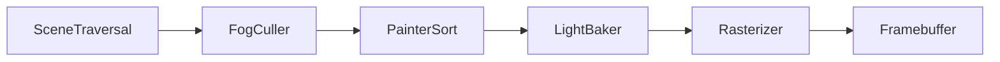

# EASEL.js

[](https://github.com/xsyetopz/easel.js/actions/workflows/ci.yml)
[](LICENSE)
[](https://www.typescriptlang.org/)
[](https://www.npmjs.com/package/@xsyetopz/easel)
[](https://www.npmjs.com/package/@xsyetopz/easel)
[](https://jsr.io/@xsyetopz/easel)
[](https://bundlephobia.com/package/@xsyetopz/easel)
[](https://www.jsdelivr.com/package/npm/@xsyetopz/easel)
[](https://jsr.io/@xsyetopz/easel)

EASEL.js is a Canvas2D software renderer and CPU rasterizer for the browser with a THREE.js-style scene graph API. Every pixel is drawn by the CPU using a painter-sorted scanline rasterizer, which makes the library a good fit for retro 3D, graphics experiments, and people searching for a browser-side software renderer instead of WebGL.

If you searched for `easeljs`, note that this project is not the original CreateJS EaselJS package. EASEL.js is a different library aimed at CPU-rendered 3D scenes and readable rendering pipelines.

## Install

```bash
# npm
npm install @xsyetopz/easel

# yarn
yarn install @xsyetopz/easel

# pnpm
pnpm install @xsyetopz/easel

# bun
bun install @xsyetopz/easel

# deno
deno add npm:@xsyetopz/easel
```

**JSR support:** `npx jsr add @xsyetopz/easel` (npm), `bunx jsr add @xsyetopz/easel` (bun), `deno add jsr:@xsyetopz/easel` (deno)

## Quick start

```js
import * as EASEL from "@xsyetopz/easel";

const [WIDTH, HEIGHT] = [800, 600];

const renderer = new EASEL.Renderer({
  canvas: document.querySelector("canvas"),
  width: WIDTH,
  height: HEIGHT,
});

const scene = new EASEL.Scene();
const camera = new EASEL.PerspectiveCamera({
  fov: 45,
  aspect: WIDTH / HEIGHT,
  near: 0.1,
  far: 100,
});
camera.position.set(0, 2, 5);

scene.add(new EASEL.AmbientLight(0xffffff, 0.4));
const sun = new EASEL.DirectionalLight(0xffffff, 0.8);
sun.position.set(3, 5, 4);
scene.add(sun);

const box = new EASEL.Mesh(
  new EASEL.BoxGeometry(1, 1, 1),
  new EASEL.LambertMaterial({ color: 0xff4444 }),
);
scene.add(box);

function animate() {
  requestAnimationFrame(animate);
  box.rotation.y += 0.01;
  renderer.render(scene, camera);
}
animate();
```

## Scene graph

EASEL.js mirrors the THREE.js API wherever it helps. If you know THREE.js, you already know the basics and can map most concepts directly.

| Category      | Classes                                                                                          |
| ------------- | ------------------------------------------------------------------------------------------------ |
| **Core**      | `Scene`, `Node`, `Group`, `Mesh`, `Raycaster`, `Clock`                                           |
| **Cameras**   | `PerspectiveCamera`, `OrthographicCamera`                                                        |
| **Lights**    | `AmbientLight`, `DirectionalLight`, `PointLight`, `SpotLight`, `HemisphereLight`                 |
| **Materials** | `BasicMaterial`, `LambertMaterial`, `ToonMaterial`, `LineMaterial`                               |
| **Geometry**  | `BoxGeometry`, `SphereGeometry`, `PlaneGeometry`, `CylinderGeometry`, `TorusGeometry`, + 15 more |
| **Textures**  | `Texture`, `CanvasTexture`, `DataTexture`, `VideoTexture`                                        |
| **Helpers**   | `BoxHelper`, `GridHelper`, `AxesHelper`, `SpotLightHelper`                                       |
| **Controls**  | `OrbitControls`                                                                                  |
| **Animation** | `Animator`, `AnimationClip`, `Track`                                                             |
| **Math**      | `Vector3`, `Matrix4`, `Quaternion`, `Color`, `Ray`, `MathUtils`                                  |

### THREE.js name mapping

| THREE.js              | EASEL.js          | Reason                  |
| --------------------- | ----------------- | ----------------------- |
| `Object3D`            | `Node`            | Scene graph node        |
| `BufferGeometry`      | `Geometry`        | No GPU buffers          |
| `WebGLRenderer`       | `Renderer`        | Single renderer         |
| `MeshBasicMaterial`   | `BasicMaterial`   | "Mesh" prefix redundant |
| `MeshLambertMaterial` | `LambertMaterial` | Same                    |
| `MeshToonMaterial`    | `ToonMaterial`    | Same                    |
| `AnimationMixer`      | `Animator`        | Plays clips             |
| `KeyframeTrack`       | `Track`           | All tracks are keyframe |

## Rendering pipeline



- **Painter's algorithm** - back-to-front sort by tile distance, Uint16 depth buffer for residual overlap
- **Flat & Gouraud shading** - per-face and per-vertex lighting, no per-pixel
- **Affine UV mapping** - no perspective correction (visible warping on large quads)
- **Linear fog** - per-vertex depth fog with configurable color, near, and far
- **Integer screen coords** - `(x + 0.5) | 0` on projected vertices
- **128x128 max texture** - nearest-neighbor, no mipmaps
- **9-step opacity** - discrete 0-8, not continuous alpha

## Migration targets

- **THREE.js users** - familiar scene graph, geometry, lighting, math, animation, and paired examples
- **Software renderer / rasterizer searches** - browser-side Canvas2D renderer with readable pipeline stages
- **CreateJS / EaselJS searchers** - not a drop-in replacement for the original 2D display-list library; aimed at CPU-rendered 3D and retro pipeline work

## Development

```bash
bun run dev            # Vite dev server + playground
bun run build          # Production build
bun run test:run       # Vitest (single run)
bun run typecheck      # tsc --noEmit
bun run biome:check    # Biome lint + format
```

## Contributing

Contributions welcome. See [CONTRIBUTING.md](CONTRIBUTING.md) for workflow, coding guidelines, and the PR checklist.

## Code of Conduct

All contributors are expected to follow the [Code of Conduct](CODE_OF_CONDUCT.md).

## Star History

<a href="https://www.star-history.com/?repos=xsyetopz%2Feasel.js&type=date&logscale=&legend=top-left">
 <picture>
   <source media="(prefers-color-scheme: dark)" srcset="https://api.star-history.com/image?repos=xsyetopz/easel.js&type=date&theme=dark&logscale&legend=top-left" />
   <source media="(prefers-color-scheme: light)" srcset="https://api.star-history.com/image?repos=xsyetopz/easel.js&type=date&logscale&legend=top-left" />
   
 </picture>
</a>

## License

[MIT](LICENSE)
